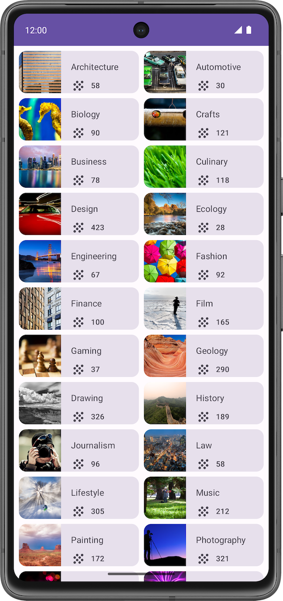
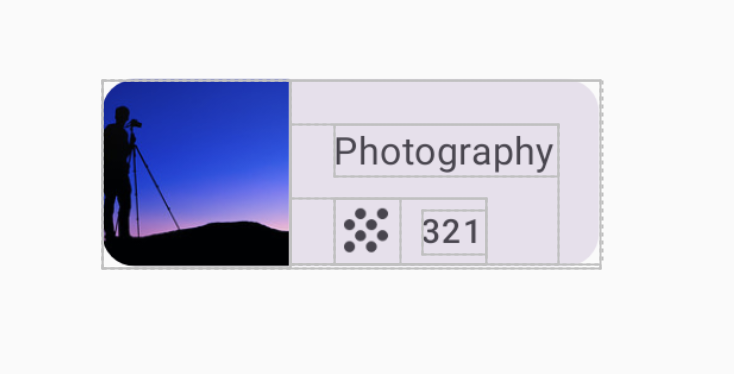
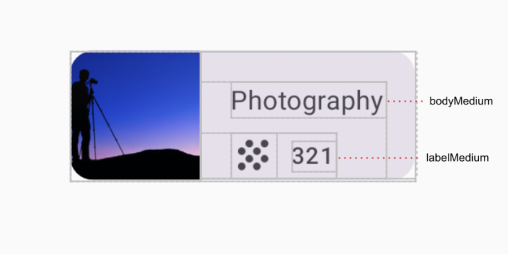
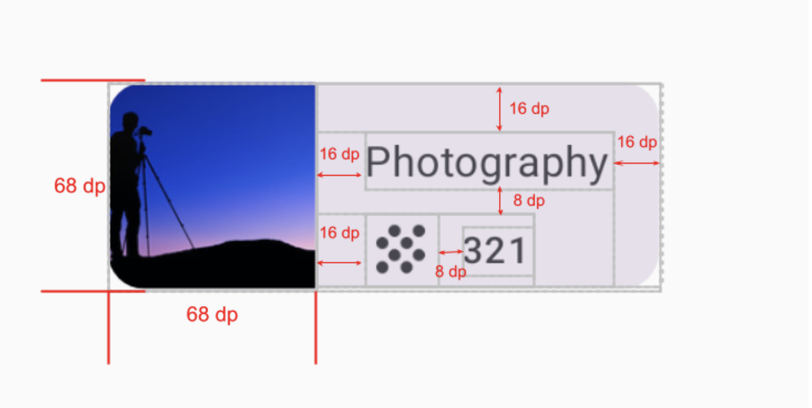
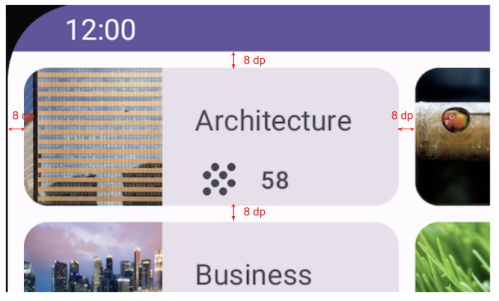

# Lab7：构建可滚动课程网格应用

## 实验背景

在之前的课堂中，我们演示了如何使用 `LazyColumn` 构建可滚动列表。本次实验将在此基础上，综合运用数据类、数据源、Compose 布局组件等知识，**从零开始**构建一款课程主题网格（Grid）应用——Courses App。

与之前提供详细步骤的 Lab 不同，本实验仅提供规格说明和提示，部分组合项或修饰符你可能尚未见过，请通过查阅资料自行探索如何使用。培养独立阅读文档、自主解决问题的能力，是本次实验的重要目标之一。

---

## 前提条件

- 已完成"添加可滚动列表"实验及之前所有 Android Basics in Compose 课程内容
- 已安装 Android Studio，具备正常的开发环境

---

## 实验目标

完成本实验后，你应能够：

- 创建数据类（Data Class）表示应用中的数据模型
- 使用 `object` 单例集中管理静态数据
- 使用 `LazyVerticalGrid` 与 `GridCells.Fixed` 构建多列网格布局
- 灵活运用 `aspectRatio`、`Row`、`Column`、`Card` 等组件完成卡片布局
- 读取并应用尚未学习过的新组合项与修饰符

---

## 所需资源

开始编码前，将以下资源放入项目对应目录：

| 资源 | 目标目录 | 说明 |
|------|----------|------|
| `Topic images/` 中的 24 张主题图片 | `res/drawable/` | 每个课程主题的配图 |
| `ic_grain.xml` | `res/drawable/` | 课程数量旁的装饰图标 |

---

## 最终效果

完成后，应用应如下图所示：



> *图 1. Courses App 最终运行效果：所有课程主题以两列网格排列，支持垂直滚动。*

---

## 实验任务

### 任务一：创建项目

使用 **Empty Activity** 模板新建一个 Android 项目，最低 SDK 版本设为 **24**。

---

### 任务二：创建 Topic 数据类

#### 目标

观察最终应用中每个课程卡片所展示的内容，归纳数据模型所需字段，并创建对应的数据类。

#### 分析

每个课程主题卡片包含以下三部分独立信息：

| 字段 | 类型 | 说明 |
|------|------|------|
| 主题名称 | `@StringRes Int` | 字符串资源 ID |
| 关联课程数量 | `Int` | 该主题下的课程数 |
| 主题图片 | `@DrawableRes Int` | 图片资源 ID |

#### 要求

在 `Topic.kt` 中创建一个名为 `Topic` 的数据类，包含上表中的三个字段。

---

### 任务三：创建数据源

#### 目标

为网格提供完整的课程主题数据集。

#### 第一步：添加字符串资源

将以下内容添加到 `app/src/main/res/values/strings.xml`：

```xml
<string name="architecture">Architecture</string>
<string name="automotive">Automotive</string>
<string name="biology">Biology</string>
<string name="crafts">Crafts</string>
<string name="business">Business</string>
<string name="culinary">Culinary</string>
<string name="design">Design</string>
<string name="ecology">Ecology</string>
<string name="engineering">Engineering</string>
<string name="fashion">Fashion</string>
<string name="finance">Finance</string>
<string name="film">Film</string>
<string name="gaming">Gaming</string>
<string name="geology">Geology</string>
<string name="drawing">Drawing</string>
<string name="history">History</string>
<string name="journalism">Journalism</string>
<string name="law">Law</string>
<string name="lifestyle">Lifestyle</string>
<string name="music">Music</string>
<string name="painting">Painting</string>
<string name="photography">Photography</string>
<string name="physics">Physics</string>
<string name="tech">Tech</string>
```

#### 第二步：创建 DataSource.kt

新建 `DataSource.kt` 文件，在其中创建一个 `object`，包含所有课程主题数据：

| 主题 | 课程数量 |
|------|--------|
| Architecture | 58 |
| Automotive | 30 |
| Biology | 90 |
| Crafts | 121 |
| Business | 78 |
| Culinary | 118 |
| Design | 423 |
| Ecology | 28 |
| Engineering | 67 |
| Fashion | 92 |
| Finance | 100 |
| Film | 165 |
| Gaming | 37 |
| Geology | 290 |
| Drawing | 326 |
| History | 189 |
| Journalism | 96 |
| Law | 58 |
| Lifestyle | 305 |
| Music | 212 |
| Painting | 172 |
| Photography | 321 |
| Physics | 321 |
| Tech | 118 |

每条数据对应一个 `Topic` 实例，图片资源名称与主题名称一致（均为小写）。

---

### 任务四：实现课程主题卡片（Topic Grid Item）

#### 目标

创建一个可组合函数，用于展示单个课程主题卡片。

#### 最终效果

卡片的外观如下：


> *图 2. 单个课程主题卡片的最终外观。*

#### 布局结构

卡片内部的层次关系如下：



> *图 3. 卡片内部的组合项层次示意。*

#### 文字样式规格



> *图 4. 主题名称使用 `bodyMedium`，课程数量使用 `labelMedium`。*

#### 尺寸规格



> *图 5. 卡片各部分的具体尺寸与间距标注。*

#### UI 规格汇总

| 元素 | 规格 |
|------|------|
| 图片尺寸 | 宽 68 dp，高 68 dp（正方形，宽高比 1:1） |
| 文字区域上内边距 | 16 dp |
| 文字区域下内边距 | 16 dp |
| 文字区域左内边距 | 16 dp |
| 文字区域右内边距 | 16 dp |
| 主题名称与图标行的间距 | 8 dp |
| 图标与课程数量数字间距 | 8 dp |
| 主题名称字体样式 | `MaterialTheme.typography.bodyMedium` |
| 课程数量字体样式 | `MaterialTheme.typography.labelMedium` |

#### 提示

> 哪个组合项让子元素垂直排列？哪个让子元素水平排列？图片左侧和文字右侧分别应该用什么布局包裹？

---

### 任务五：实现课程网格（Courses Grid）

#### 目标

使用任务四中的卡片组合项，构建一个**两列**可滚动网格，展示所有课程主题。

#### 最终效果

完成后，网格布局如下：



> *图 6. 网格卡片之间的间距规格。*

#### UI 规格

| 元素 | 规格 |
|------|------|
| 列数 | 2 列 |
| 卡片水平间距 | 8 dp |
| 卡片垂直间距 | 8 dp |
| 网格整体内边距 | 8 dp |

#### 提示

> `LazyVerticalGrid` 接受哪些参数来控制列数和内容间距？`contentPadding` 与 `Arrangement.spacedBy` 分别控制什么？

---

## 代码结构参考

```text
app/
└── src/
    └── main/
        ├── java/com/example/courses/
        │   ├── MainActivity.kt          # 主界面入口，调用网格组合项
        │   ├── model/
        │   │   └── Topic.kt             # 数据类
        │   └── data/
        │       └── DataSource.kt        # 静态数据源
        └── res/
            ├── drawable/
            │   ├── architecture.jpg
            │   ├── automotive.jpeg
            │   ├── ...                  # 其余主题图片（共 24 张）
            │   └── ic_grain.xml         # 装饰图标
            └── values/
                └── strings.xml          # 主题名称字符串资源
```

---

## 提示

- `LazyVerticalGrid` 在 `androidx.compose.foundation.lazy.grid` 包下，确认项目依赖版本支持该组件
- 使用 `aspectRatio(1f)` 而非固定宽高，可让图片在不同屏幕下自适应
- `contentPadding` 控制整个网格四周的留白，`Arrangement.spacedBy` 控制相邻卡片之间的间距，两者共同使用才能实现图 6 的效果
- 字符串资源通过 `stringResource(id)` 读取，图片资源通过 `painterResource(id)` 读取
- 截图请使用 Android Studio 内置的截图功能，**严禁使用手机拍屏幕**

---

## 提交要求

在自己的文件夹下新建 `Lab7/` 目录，提交以下文件：

```text
学号姓名/
└── Lab7/
    ├── MainActivity.kt       # 主要源代码（命名规范，结构合理）
    ├── Topic.kt              # 数据类源码
    ├── DataSource.kt         # 数据源源码
    ├── screenshot.png        # 应用运行截图
    └── report.md             # 实验报告
```

`report.md` 需包含：

1. 应用整体结构说明（数据类、数据源、组合项的组织方式）
2. `Topic` 数据类的字段设计与选择理由
3. 卡片布局实现思路（使用了哪些组合项，如何嵌套）
4. 网格布局实现思路（`LazyVerticalGrid` 参数配置说明）
5. 遇到的问题与解决过程

---

## 验收标准

满足以下条件可视为完成实验：

- 应用可正常运行，界面无崩溃
- 展示全部 24 个课程主题，以两列网格方式排列
- 每个卡片正确显示主题图片、名称和课程数量
- 网格支持垂直滚动
- 布局与 UI 规格一致（图片比例 1:1、字体样式、间距）
- 报告中能清晰说明数据类设计与布局实现思路

---

## 截止时间

**2026-05-08**，届时关于 Lab7 的 PR 请求将不会被合并。
